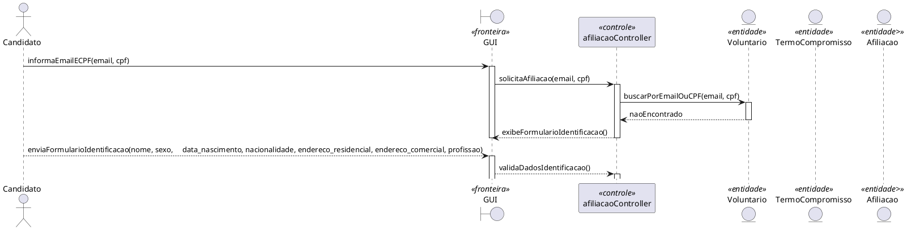

```plantuml
@startuml

actor "Candidato" as candidato
boundary "GUI" as gui <<fronteira>> 
participant "afiliacaoController" as controller <<controle>> 
entity "Voluntario" as voluntario <<entidade>> 
entity "TermoCompromisso" as termo <<entidade>>     
entity "Afiliacao" as afiliacao <<entidade>>>

candidato -> gui: informaEmailECPF(email, cpf)
activate gui
gui -> controller: solicitaAfiliacao(email, cpf)
activate controller

controller -> voluntario: buscarPorEmailOuCPF(email, cpf)
activate voluntario
voluntario --> controller: naoEncontrado
deactivate voluntario

controller --> gui: exibeFormularioIdentificacao()
deactivate gui

deactivate controller

candidato --> gui: enviaFormularioIdentificacao(nome, sexo,     data_nascimento, nacionalidade, endereco_residencial, endereco_comercial, profissao)
activate gui

gui --> controller: validaDadosIdentificacao()
activate controller


@enduml
```