# Telas UC002
---
### Fluxo principal

1. Candidato informa seu email e CPF (CNPJ, se for pessoa jurídica) e solicita afiliação

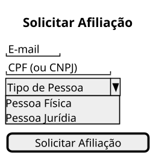
4. Candidato preenche formulário de identificação e submete

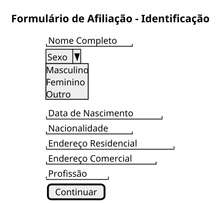

7. Candidato preenche o formulário e submete

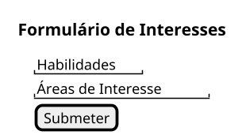

10. Candidato aceita as diretrizes estabelecidas no termo de aceite

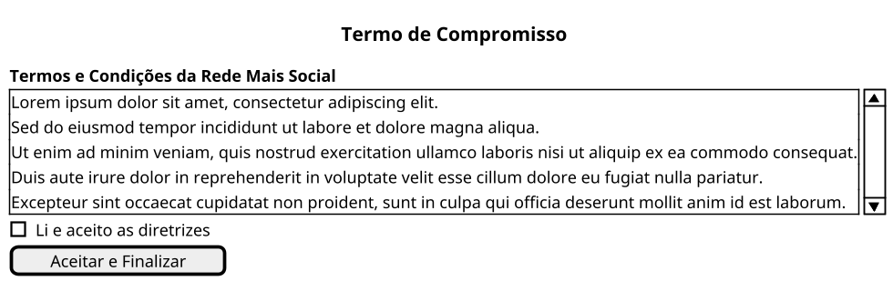

13. Sistema exibe mensagem solicitando a validação do e-mail informado
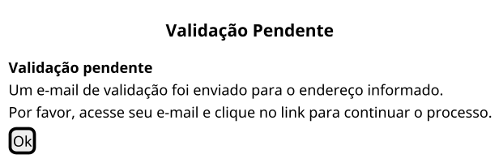

16. Sistema informa a situação do candidato que está esperando a aprovação de sua afiliação pela Rede Mais Social e deve receber liberação em breve

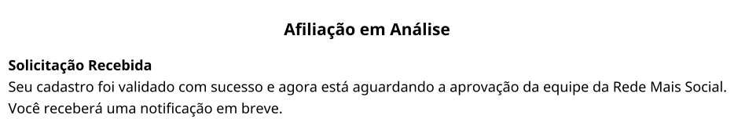

## Fluxos Alternativos

Email ou CPF(ou CNPJ) encontrados 

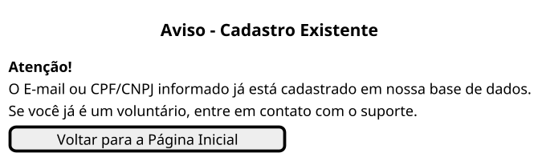

Dados inválidos ou não informados

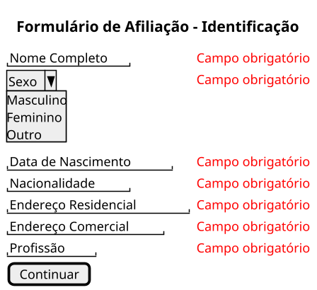

Candidato anexa certidões e preenche formulário de identificação do representante legal e submete

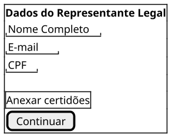

Candidato não aceita diretrizes

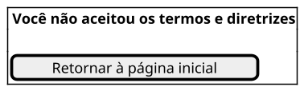

 Candidato Não acessa Link de Validação no prazo
 ```plantuml
@startsalt
scale 1.5
{
  {+
  <b> Você ainda não validou seu E-mail
  .
  [Enviar link de validação]
  }
}
@endsalt
```


# Telas UC003

### Fluxo Principal
2. Sistema apresenta relação de candidatos pendentes de aprovação: 
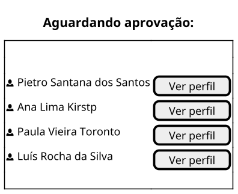
4. Sistema exibe informações detalhadas do candidato
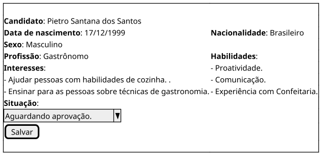

6. Sistema muda situação do candidato a Voluntário para aprovado e armazena

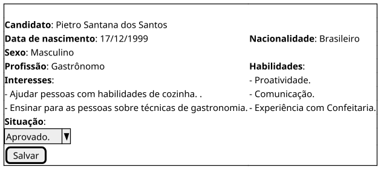

7. Sistema exibe perfil, habilidades e interesses do voluntário.
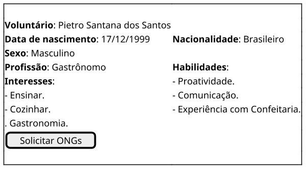

9. Sistema busca ONG que combina com perfil do voluntário na base e exibe relação de ONG e campanhas para o voluntário

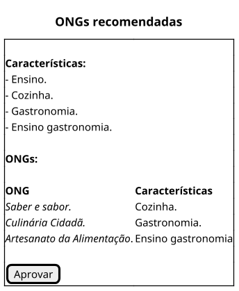

15. Sistema exibe mensagem de aprovação realizada com sucesso na tela 

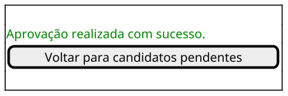

16. Sistema apresenta a relação de candidatos pendentes de aprovação e volta para o Passo 3.
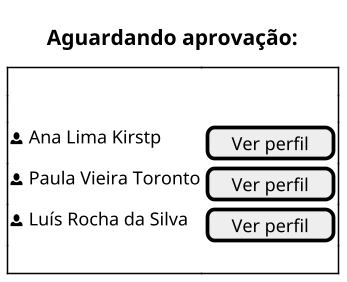

### Fluxos alternativos

#### Não há candidatos para aprovação - Passo 2
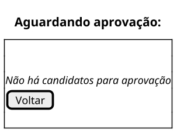

#### Candidato reprovado - Passo 5

6. Sistema muda situação do candidato a Voluntário para “Rejeitado” e armazena
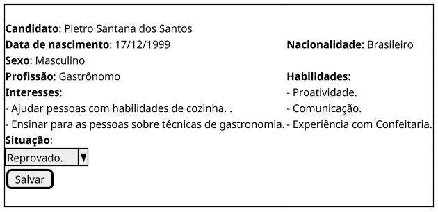

7. Sistema exibe campo para relatar motivo da Rejeição
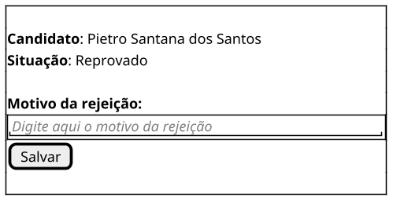

11. Sistema exibe mensagem de rejeição realizada com sucesso na tela
```plantuml
@startsalt
scale 1.5
{+
     
    .
    <color:green>Rejeição realizada com sucesso.
    .
    [Voltar para candidatos pendentes]
    .

}
@endsalt
```

12. Sistema apresenta a relação de candidatos pendentes de aprovação e volta para o Passo 3
```plantuml
@startsalt
scale 1.5
{+
    .
    title Aguardando aprovação:
    .  
    <&person> Ana Lima Kirstp | [Ver perfil] 
    <&person> Paula Vieira Toronto | [Ver perfil] 
    <&person> Luís Rocha da Silva | [Ver perfil] 
    .
}
@endsalt
```

#### Não existem ONGs para recomendar - Passo 9

```plantuml
@startsalt
scale 1.5
{+ 
title "ONGs recomendadas"
    .
    **Características:** 
    - Ensino. 
    - Cozinha.
    - Gastronomia. 
    - Ensino gastronomia.
    .
    **ONGs:**
    .

    **ONG** | **Características**
    //Sem ONGs para recomendar//|
    .
    [Aprovar]

}
@endsalt
```

13. Sistema exibe mensagem de aprovação realizada com sucesso na tela 

```plantuml
@startsalt
scale 1.5
{+
     
    .
    <color:green>Aprovação realizada com sucesso.

    [Voltar para candidatos pendentes]
    .

}
@endsalt
```
