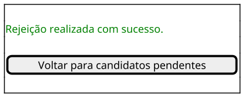
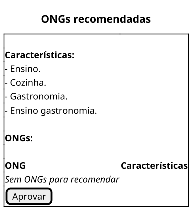

# Telas UC002
---
### TELA 1 - Solicitar Afiliação

### TELA 2 - Formulário de identificação

### TELA 3 - Formulário de perfil, habilidades e interesses

### TELA 4 - Termos de compromisso

### TELA 5 - Validação pendente

### TELA 6  - Validação em análise

# Telas UC003

### Fluxo Principal
2. Sistema apresenta relação de candidatos pendentes de aprovação: 

4. Sistema exibe informações detalhadas do candidato

6. Sistema muda situação do candidato a Voluntário para aprovado e armazena

7. Sistema exibe perfil, habilidades e interesses do voluntário.

9. Sistema busca ONG que combina com perfil do voluntário na base e exibe relação de ONG e campanhas para o voluntário

15. Sistema exibe mensagem de aprovação realizada com sucesso na tela 

16. Sistema apresenta a relação de candidatos pendentes de aprovação e volta para o Passo 3.

### Fluxos alternativos

#### Não há candidatos para aprovação - Passo 2

#### Candidato reprovado - Passo 5

6. Sistema muda situação do candidato a Voluntário para “Rejeitado” e armazena

7. Sistema exibe campo para relatar motivo da Rejeição

11. Sistema exibe mensagem de rejeição realizada com sucesso na tela

12. Sistema apresenta a relação de candidatos pendentes de aprovação e volta para o Passo 3

#### Não existem ONGs para recomendar - Passo 9

13. Sistema exibe mensagem de aprovação realizada com sucesso na tela 

